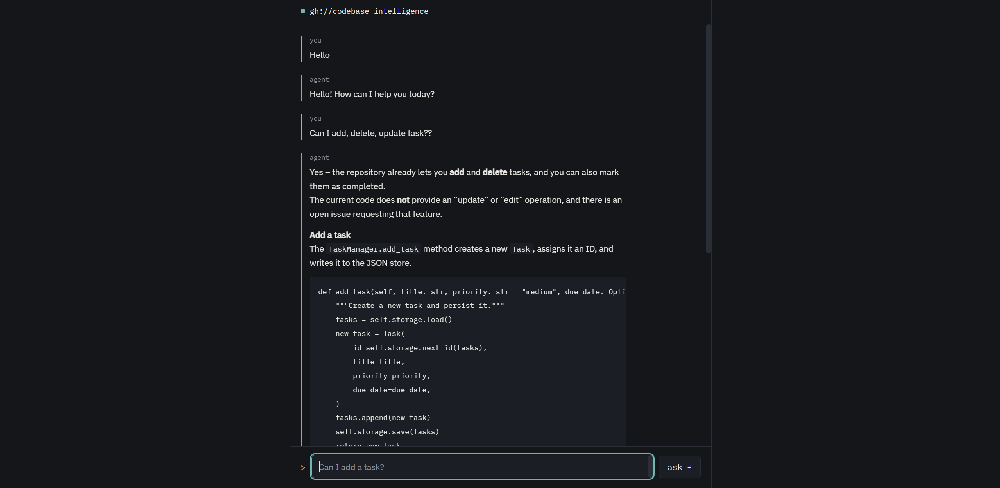

# Codebase Intelligence Agent

An AI agent that answers natural-language questions about a GitHub repository — its issues, its source code, and its docs — with grounded, source-cited answers. Ask it "can I add a task?" and it won't just guess from general knowledge of what a typical CRUD app looks like; it retrieves the actual `add_task` implementation, quotes the real function signature, and links back to the exact file and line range it came from.



## Why this exists

Most "chat with your repo" demos embed a whole file as one vector and hope for the best. That's fine for a README, but it falls apart on source code: a whole file usually mixes several unrelated functions, so a question about one specific function pulls back the entire file — mostly noise. This project chunks source code at function/class/method granularity using Python's `ast` module instead, so a question about `delete_task` retrieves `delete_task`, not the whole module.

It's also built to not make things up. Every factual claim in an answer is tied to a citation from something actually retrieved — a specific GitHub issue, a specific function, or a specific doc section — reproduced verbatim, including the link. If the agent doesn't have grounding for something, it says so instead of guessing.

## How it works

```
GitHub repo (issues, .py source, .md docs)
        │
        ▼
  ingestion scripts (ingest_issues.py / ingest_code.py / ingest_docs.py)
        │  issues:  one chunk per issue
        │  code:    one chunk per function / class / method (ast-based)
        │  docs:    one chunk per markdown section (## heading-based)
        ▼
  Astra DB (vector store) ── embeddings via Gemini
        │
        ▼
  LangChain agent (search_repo tool + Gemini or local Ollama model)
        │  every retrieved chunk carries a precomputed citation string
        ▼
  FastAPI (POST /ask, stateless — client resends full conversation)
        │
        ▼
  static UI (index.html — terminal-styled, no build step)
```

Each ingestion script chunks its source type differently (issues stay whole, code splits by function/class, docs split by heading) but writes a uniform `citation` field, so the agent's answer-formatting logic doesn't need to know or care which kind of document it's citing.

## Tech stack

- **LLM + embeddings:** Gemini (`gemini-flash-latest` for chat, `gemini-embedding-001` for embeddings), via `langchain-google-genai`. Chat model is swappable to a local Ollama model (no rate limit) via `CHAT_PROVIDER`.
- **Agent framework:** LangChain 1.0+ (`create_agent`, running on LangGraph)
- **Vector store:** Astra DB (`langchain-astradb`)
- **GitHub access:** PyGithub
- **API:** FastAPI, one endpoint (`POST /ask`)
- **UI:** a single static HTML file, vanilla JS, no framework, no build step

## Setup

1. Clone the repo and create a virtual environment.
2. `pip install -r requirements.txt`
3. Copy `.env.example` to `.env` and fill in:
   - `GEMINI_API_KEY`, `GITHUB_TOKEN`
   - `TARGET_REPO` — the `owner/repo` this agent should answer questions about
   - `ASTRA_DB_APPLICATION_TOKEN`, `ASTRA_DB_API_ENDPOINT`, `ASTRA_DB_KEYSPACE`
   - `CHAT_PROVIDER` — `gemini` (rate-limited free tier) or `ollama` (local, needs Ollama running with the model in `OLLAMA_MODEL` pulled)
4. Ingest the target repo (run once, or again any time it changes — re-running upserts rather than duplicating):
   ```
   python src/ingest_issues.py
   python src/ingest_code.py
   python src/ingest_docs.py
   ```
5. Start the API:
   ```
   uvicorn src.api:app --reload
   ```
6. Open `index.html` directly in a browser (it's standalone — no server needed to serve it). The status dot in the header confirms it can reach the API.

You can also talk to the agent directly from the terminal without the API or UI: `python src/agent.py`.

## Known limitations

- **No server-side conversation persistence.** `/ask` is stateless; the client resends the full message history on every call (the same pattern OpenAI's chat API uses). There's no session storage or database — deliberate, not an oversight, for a project this scoped.
- **CORS is wide open (`allow_origins=["*"]`).** Fine for running locally; would need real origin restriction before any public deployment.
- **A citation can occasionally land inside a markdown code fence** in the raw agent output, where it won't render as a clickable link. The UI's link-detection deliberately doesn't try to hack around this — it's a model/prompt-level formatting quirk, not a data or grounding problem.
- **Local Ollama models with incomplete tool-calling support** (e.g. `gpt-oss:20b`) can occasionally leak raw tool-call tokens into visible output. Not present when using Gemini as the chat provider.
- No auth, no deployment config, no formal evaluation suite — all intentionally out of scope for this version.
